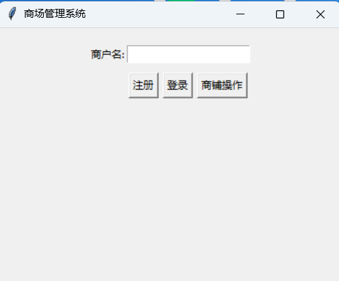
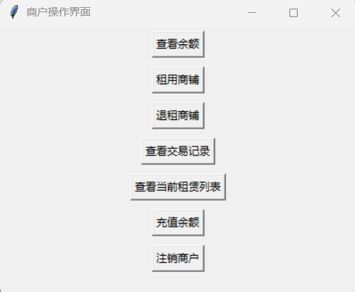
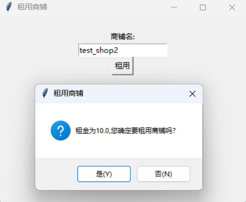
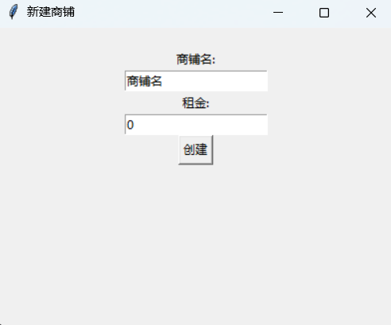

# 项目介绍
一个简单的商场管理系统

# 软件使用说明
## 基础页面

在这个页面中，你可以输入商户名进行注册或是登录
如果需要进行商铺操作，请输入"admin"账户并点击商铺操作按钮以进入下一级页面

## 商户使用说明

在这个页面中提供了不同的商户操作功能
### 余额查询与余额充值
点击按钮可进行余额查询，如果是第一次注册，在查询余额是会帮助用户跳转至充值界面
点击按钮进行余额充值，在充值页面输入合法的非负数字作为充值金额

### 商铺的租赁与退租
点击按钮进入租赁页面

输入想要租赁的商铺名，点击租赁后会弹出对应的租金，如果账户余额不足则无法租赁，在确认租赁后将直接扣除第一个月的租金

点击按钮进入退租页面，输入想要退租的商铺名并确定即可完成退租

### 查看当前租赁的商铺列表和交易条目
点击对应按钮即可查看余额明细和正在租赁的店铺

### 商户注销
点击注销商户会删除商户的信息，自动退租当前所有在租商铺，并删除存储的所有交易条目

## 商铺管理
### 添加，注销商铺
管理员进入商铺管理平台，选择新建商铺，输入商铺名以及租金即可完成商铺资源的扩充

注销商铺时只需进入注销窗口并直接输入商铺名即可

### 租金修改
点击进入修改租金界面，输入商铺名以及修改后的租金点击确认即可

## 数据库资源查看
在管理员页面点击对应按钮，即可查看商户表、商铺表和交易记录表
